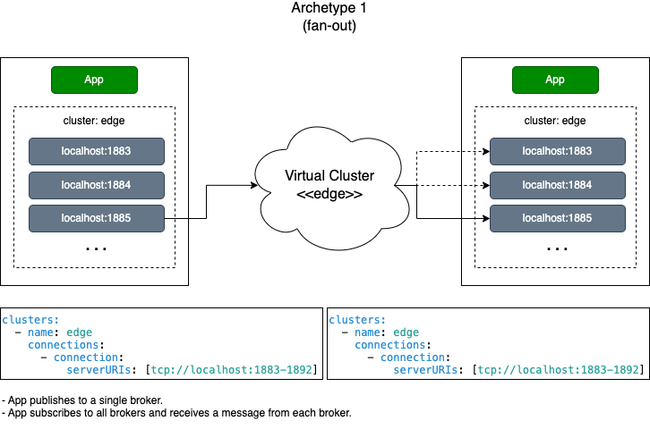
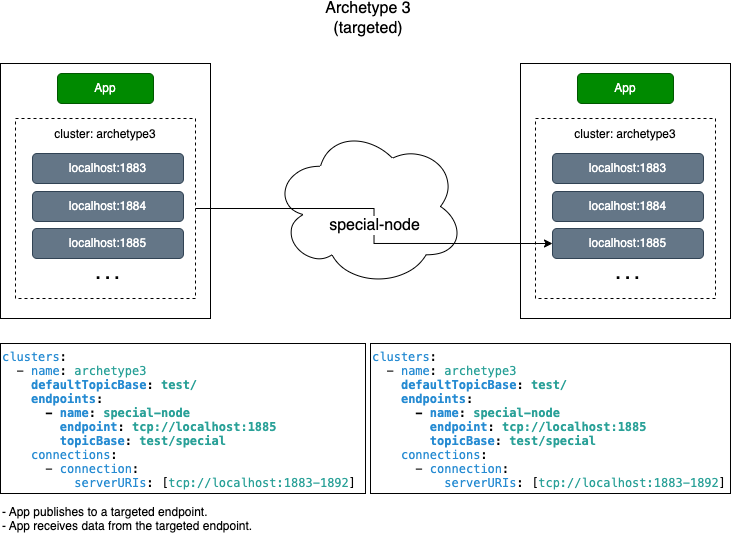
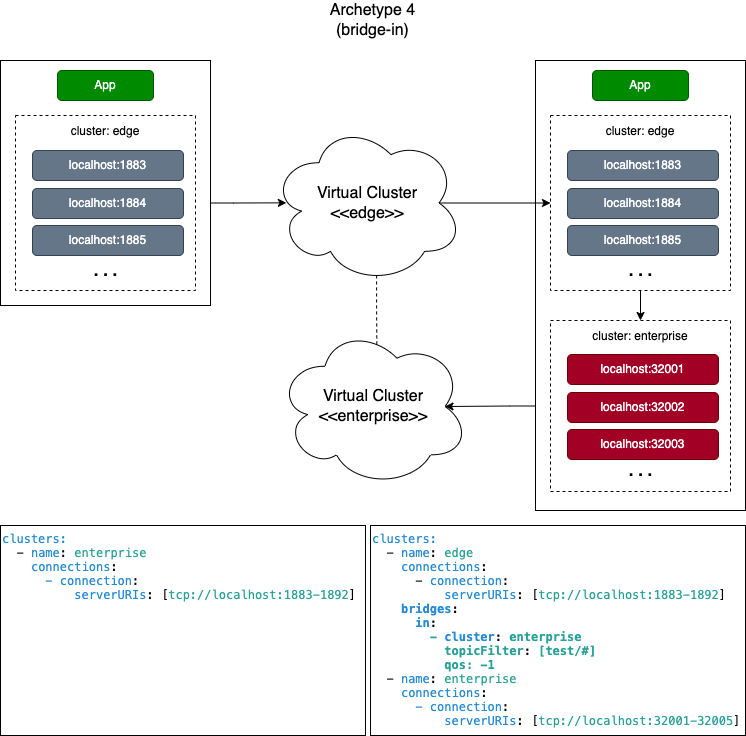

 [*PadoGrid*](https://github.com/padogrid) | [*Catalogs*](https://github.com/padogrid/catalog-bundles/blob/master/all-catalog.md) | [*Manual*](https://github.com/padogrid/padogrid/wiki) | [*FAQ*](https://github.com/padogrid/padogrid/wiki/faq) | [*Releases*](https://github.com/padogrid/padogrid/releases) | [*Templates*](https://github.com/padogrid/padogrid/wiki/Using-Bundle-Templates) | [*Pods*](https://github.com/padogrid/padogrid/wiki/Understanding-Padogrid-Pods) | [*Kubernetes*](https://github.com/padogrid/padogrid/wiki/Kubernetes) | [*Docker*](https://github.com/padogrid/padogrid/wiki/Docker) | [*Apps*](https://github.com/padogrid/padogrid/wiki/Apps) | [*Quick Start*](https://github.com/padogrid/padogrid/wiki/Quick-Start)

---

# Mosquitto/MQTT Virtual Cluster Tutorial

This bundle provides a hands-on tutorial demonstrating PadoGrid's virtual cluster capabilities.

## Installing Bundle

```bash
install_bundle -download -workspace bundle-mosquitto-tutorial-virtual-clusters
```

## Use Case

This tutorial bundle walks through archetypes that represent specific MQTT virtual clusters for implementing use cases.


## Required Software

- PadoGrid 0.9.25+
- Mosquitto 2.x

## Bundle Contents

```console
apps
└── mqtt_tutorial
    └── etc
        ├── mqttv5-archetype1.yaml
        ├── mqttv5-archetype2.yaml
        ├── mqttv5-archetype3.yaml
        ├── mqttv5-archetype4.yaml
        ├── mqttv5-archetype5.yaml
        ├── mqttv5-archetype6.yaml
        ├── mqttv5-archetype7.yaml
        └── mqttv5-archetype8.yaml
```

## Table of Contents

1. [Configuring Bundle Environment](#configuring-bundle-environment)
2. [Startup Sequence](#startup-sequence)
   1. [Archetype 1](#archetype-1)
      1. [By Cluster](#by-cluster)
      1. [By Configuration](#by-configuration)
      1. [By Endpoints](#by-endpoints)
   1. [Archetype 1 Summary](#archetype-1-summary)
   1. [Archetype 2](#archetype-2)
   1. [Archetype 2 Summary](#archetype-2-summary)
   1. [Archetype 3](#archetype-3)
   1. [Archetype 3 Summary](#archetype-3-summary)
   1. [Archetype 4](#archetype-4)
   1. [Archetype 4 Summary](#archetype-4-summary)
   1. [Archetype 5](#archetype-5)
   1. [Archetype 5 Summary](#archetype-5-summary)
   1. [Archetype 6](#archetype-6)
   1. [Archetype 6 Summary](#archetype-6-summary)
   1. [Archetype 7](#archetype-7)
   1. [Archetype 7 Summary](#archetype-7-summary)
   1. [Archetype 8](#archetype-8)
   1. [Archetype 8 Summary](#archetype-8-summary)
3. [Teardown](#teardown)
3. [References](#references)

## Configuring Bundle Environment

This tutorial requires three (3) Mosquitto clusters. Let's create the first two (2) clusters now. We will create the third cluster later.

```bash
# First, switch into the bundle workspace
switch_workspace bundle-mosquitto-tutorial-virtual-clusters

# Create edge cluster with 10 members
make_cluster -product mosquitto -cluster edge
switch_cluster edge
add_member -count 7

# Create enterprise cluster with 5 members
make_cluster -product mosquitto -cluster enterprise -port 32001
switch_cluster enterprise
add_member -count 2

# Start all clusters in the workspace
start_workspace -quiet
```

## Startup Sequence

Open three (3) terminals. From each terminal, switch into the **edge** cluster.

```bash
switch_workspace bundle-mosquitto-tutorial-virtual-clusters
switch_cluster edge
```

---

### Archetype 1

Archetype 1 refers to a baseline virtual cluster providing the effect of a *fan-out* architecture: **one publisher and many subscribers**. In Archetype 1, the receiver subscribes to all the brokers in the virtual cluster. The sender delivers each message using a single publisher that is connected to one of the brokers. The receiver receives the message via the subscriber connected to that broker. The publisher is selected by one of the methods shown below. The default method is `publisherType: STICKY`. The publisher "sticks" to one endpoint for all operations.

- By `publisherType`. Valid values are `STICKY`, `RANDOM`, `ROUND_ROBIN`, and `ALL`.
- By endpoint name. Each endpoint is identifiable by a unqiue name.
- By topic base. Each endpoint can be tied to a topic base.

```yaml
clusters:
  - name: edge
    connections:
      - connection:
          serverURIs: [tcp://localhost:1883-1892]
```



PadoGrid is equipped with the `vc_publish` and `vc_subscribe` commands for publishing and subscribing messages to virtual clusters. By default, they automatically create a virtual cluster representing the current physical cluster in the workspace. For our example, these commands automatically construct the above configuration to form a virtual cluster. This is quite convenient since we can simply run these commands without specifying all the endpoints.

#### By Cluster

Run `vc_publish` and `vc_subscribe` as follows.

 Terminal 1

```bash
switch_cluster edge
vc_subscribe -t test/#
```

 Terminal 2

```bash
switch_cluster edge
vc_subscribe -t test/#
```
            
 Terminal 3

```bash
switch_cluster edge
vc_publish -t test/topic1 -m "hello, world 1"
vc_publish -t test/topic1 -m "hello, world 2"
vc_publish -t test/topic1 -m "hello, world 3"
```

**Output:**

You should see Terminal 1 and Terminal 2 ouput as follows.

```console
PadoGrid Cluster: edge
cluster: edge (virtual)
endpoints: tcp://localhost:1883-1892
fos: 0
qos: 0
topicFilter: test/#
Waiting for messages...
tcp://localhost:1883 - test/topic1: hello, world 1
tcp://localhost:1891 - test/topic1: hello, world 2
tcp://localhost:1885 - test/topic1: hello, world 3
```

- `PadoGrid Cluster: edge` indicates the current physical cluster name. The `switch_cluster` command that you have executed swiched the cluster context to `edge`.

- `cluster: cfcdeb93-e6f3-47f2-88f3-c134d2a2e1a6 (virtual)` indicates a unique virtual cluster name that is used as the client ID to connect to the brokers. `vc_subscribe` automatically generates a unique cluster name in order to prevent conflicts.

- `fos: 0` is the default FoS 0 level.

- `qos: 0` is the default QoS 0 level.

- `topicFilter: test/#` is ithe topic filter you have entered in the command line.

Note that the endpoints shown in the received messages are different from each other. This is because `HaMqttClient` first shuffles the live endpoint list before selecting a publisher. By default, `HaMqttClient` has `publisherType` of `STICKY`, so that it "sticks" to the selected publisher for all subsequent operations until the publisher fails. Upon failure, it selects the next publisher from the live endpoint list.

You may find the `vc_publish` command a bit slow. This is because it has to make 10 broker connections. You can reduce the number of connections by specifying the `-endpoints` option. For example, the following commands should execute quickly since they only connect to a single endpoint.

 Terminal 3

```bash
vc_publish -endpoints tcp://localhost:1883 -t test/topic1 -m "hello to single endpoint 1"
vc_publish -endpoints tcp://localhost:1891 -t test/topic1 -m "hello to single endpoint 2"
vc_publish -endpoints tcp://localhost:1885 -t test/topic1 -m "hello to single endpoint 3"
```

You can also run Mosquitto's `mosquitto_pub` to publish messages into the virtual cluster as shown below. A downside of using `mosquitto_pub` is that you must target a specific broker in the virtual cluster.

 Terminal 3

```bash
mosquitto_pub -p 1883 -t test/topic1 -m "hello from mosquitto_pub 1"
mosquitto_pub -p 1891 -t test/topic1 -m "hello from mosquitto_pub 2"
mosquitto_pub -p 1885 -t test/topic1 -m "hello from mosquitto_pub 3"
```

**Output:**

You should see Terminal 1 and Terminal 2 ouput as follows.

```console
PadoGrid Cluster: edge
cluster: edge (virtual)
endpoints: tcp://localhost:1883-1892
fos: 0
qos: 0
topicFilter: test/#
Waiting for messages...
tcp://localhost:1883 - test/topic1: hello, world 1
tcp://localhost:1891 - test/topic1: hello, world 2
tcp://localhost:1885 - test/topic1: hello, world 3
tcp://localhost:1883 - test/topic1: hello to single endpoint 1
tcp://localhost:1891 - test/topic1: hello to single endpoint 2
tcp://localhost:1885 - test/topic1: hello to single endpoint 3
tcp://localhost:1883 - test/topic1: hello from mosquitto_pub 1
tcp://localhost:1891 - test/topic1: hello from mosquitto_pub 2
tcp://localhost:1885 - test/topic1: hello from mosquitto_pub 3
```

#### By Configuration

Instead of using the `-cluster` option, you can use the `-config` option to create a virtual cluster. The configuration file for this example is provided in the `mqtt_tutorial` app's `etc` directory. 

`etc/mqttv5-archetype1.yaml`:

```yaml
defaultCluster: edge
clusters:
  - name: edge
    connections:
      - connection:
          serverURIs: [tcp://localhost:1883-1892]
```

The following commands have the same effect as the `-cluster` option.

 Terminal 2

```bash
# Ctrl-C to exit the vc_subscribe command and execute the following:
cd_app mqtt_tutorial
vc_subscribe -config etc/mqttv5-archetype1.yaml -t test/#
```

 Terminal 3

```bash
cd_app mqtt_tutorial
vc_publish -config etc/mqttv5-archetype1.yaml -t test/topic1 -m "hello from config file"
```

You should see both Terminal 1 and Terminal 2 receiving the same message.

#### By Endpoints

You can also create a virtual cluster on the fly by spcifying endpoints. We have actually created a virtual cluster this way previously when we published messages by specifying the `-endpoints` option to the `vc_publish` command. The `-endpoints` option is quite useful for testing and troubleshooting. The following example creates the same virtual cluster environment that we created in the previous sections.

 Terminal 2

```bash
# Ctrl-C to exit the vc_subscribe command and execute the following:
vc_subscribe -endpoints tcp://localhost:1883-1892 -t test/#
```

 Terminal 3

```bash
vc_publish -endpoints tcp://localhost:1883-1892 -t test/topic1 -m "hello from endpoints"
```

You should see both Terminal 1 and Terminal 2 receiving the same message.

### Archetype 1 Summary

Archetype 1 configures a baseline virtual cluster for sending and receiving data between applications. Using `vc_publish` and `vc_subscribe`, we can create and test virtual clusters on the fly. We can think of Archetype 1 as a peer-to-peer topology for applications that require high availability and scalability of clustered MQTT brokers. For example, using Archetype 1, we can create a virtual cluster environment for edge devices that can freely leave or join the cluster. We can dedicate a block of IP addresses for IoT devices which can autonomously communicate with each other without the central system.

The following example creates a virtual cluster that dedicates the entire usable IP addresses of subnet `192.0.1.1/24`. With Archtype 1, data roaming is possible for any edge device with the IP address in this subnet range.
 
```yaml
clusters:
  - name: edge
    connections:
      - connection:
          serverURIs: [tcp://192.0.1.1-254]
```  

---

### Archetype 2

Archetype 2 is inverse of Archetype 1. Instead of targeting individual brokers, it targets all the brokers in the virutal cluster providing the effect of a *fan-in* architecture: **many publishers and one subscriber**. Since each receiver has one active subscriber, they receive messages from only one broker. From the applicaton perspective, there is no difference between Archetype 1 and Archetype 2. They both send and receive messages via their respective virtual cluster with the same result. Archetype 2 is useful in an environment where the reachability of IoT devices is not guaranteed due to poor wireless networks, device mobility and failures, firewalls, and etc. Unlike Archetype 1, which relies on a stable network for the publisher to reach endpoints, Archetype 2 relies on broadcasted messages to reach endpoints regardless of network issues.

```yaml
defaultCluster: edge
clusters:
  - name: edge
    fos: 3
    publisherType: ALL
    subscriberCount: 2
    connections:
      - connection:
          serverURIs: [tcp://localhost:1883-1892]
```


 Terminal 1

```bash
# Ctrl-C to terminate the running program

# Subscribe to a virtual cluster using the provided Archetype 2 configuration file
cd_app mqtt_tutorial
vc_subscribe -config etc/mqttv5-archetype2.yaml -t test/#
```

Output:

```console
LOG_FILE: /Users/dpark/.padogrid/log/vc_subscribe.log
cluster: edge (virtual)
fos: 0
qos: 0
config: etc/mqttv5-archetype2.yaml
topicFilter: test/#
Waiting for messages...
```

 Terminal 2

```bash
# Ctrl-C to terminate the running program

# Monitor the vc_subscribe log file
tail -f ~/.padogrid/log/vc_subscribe.log
```

Output:

```console
2023-05-19 16:54:14 INFO  HaMqttClient:125 - HaMqttClient created [clusterName=edge, publisherType=ALL]
2023-05-19 16:54:14 INFO  ClusterState[edge]:285 - Added/updated endpoints [endpoints=tcp://localhost:1883,tcp://localhost:1884,tcp://localhost:1885,tcp://localhost:1886,tcp://localhost:1887,tcp://localhost:1888,tcp://localhost:1889,tcp://localhost:1890,tcp://localhost:1891,tcp://localhost:1892]. All endpoints [tcp://localhost:1887, tcp://localhost:1888, tcp://localhost:1885, tcp://localhost:1886, tcp://localhost:1883, tcp://localhost:1884, tcp://localhost:1892, tcp://localhost:1890, tcp://localhost:1891, tcp://localhost:1889]. Dead endpoints [[tcp://localhost:1883, tcp://localhost:1884, tcp://localhost:1885, tcp://localhost:1886, tcp://localhost:1887, tcp://localhost:1888, tcp://localhost:1889, tcp://localhost:1890, tcp://localhost:1891, tcp://localhost:1892]]
2023-05-19 16:54:17 INFO  ClusterState[edge]:840 - Revived endpoints [tcp://localhost:1883, tcp://localhost:1884, tcp://localhost:1885, tcp://localhost:1886, tcp://localhost:1887, tcp://localhost:1888, tcp://localhost:1889, tcp://localhost:1890, tcp://localhost:1891, tcp://localhost:1892]. Live endpoints [tcp://localhost:1883, tcp://localhost:1884, tcp://localhost:1885, tcp://localhost:1886, tcp://localhost:1887, tcp://localhost:1888, tcp://localhost:1889, tcp://localhost:1890, tcp://localhost:1891, tcp://localhost:1892]. Dead endpoints [].
2023-05-19 16:54:17 INFO  ClusterState[edge]:1153 - All endpoints connected [edge]. [Pool: 10, All: 10, Live: 10, Dead: 0, Subscribers: 2]. Dead endpoints [].
2023-05-19 16:54:17 INFO  ClusterService:229 - initialized [isServiceEnabled=true, delayInMsec=5000]
2023-05-19 16:54:17 INFO  ClusterService:333 - ClusterService started: ClusterService [isServiceEnabled=true, delayInMsec=5000, tag=cluster-tag, isStarted=true]
```

 Terminal 3

```bash
# Publish messages to the Archetype 2 virtual cluster
cd_app mqtt_tutorial
vc_publish -config etc/mqttv5-archetype2.yaml  -t test/topic1 -m "Archetype 2 message 1"
vc_publish -config etc/mqttv5-archetype2.yaml  -t test/topic1 -m "Archetype 2 message 2"
vc_publish -config etc/mqttv5-archetype2.yaml  -t test/topic1 -m "Archetype 2 message 3"
```

Output:

```console
...
LOG_FILE: /Users/dpark/.padogrid/log/vc_publish.log
cluster: edge (virtual)
fos: 0
qos: 0
config: etc/mqttv5-archetype2.yaml
topic: test/topic1
message: Archetype 2 message 3
```

 Terminal 1

You should also see Terminal 1 ouputs as follows.

```console
LOG_FILE: /Users/dpark/.padogrid/log/vc_subscribe.log
cluster: edge (virtual)
fos: 0
qos: 0
config: etc/mqttv5-archetype2.yaml
topicFilter: test/#
Waiting for messages...
tcp://localhost:1890 - test/topic1: Archetype 2 message 1
tcp://localhost:1890 - test/topic1: Archetype 2 message 2
tcp://localhost:1890 - test/topic1: Archetype 2 message 3
```

Note that all the messages are received from `tcp://localhost:1890`. We have 10 endpoints clustered and dedicated two (2) subcribers for listening on incoming messages. Only one of the subscribers actively delivers messages to the application's callback. In our case, `vc_subscribe` has a callback that listens on the topic filter, `test/#`.

 Terminal 3

Let's now stop the broker (member) that the active subscriber is connected to. To do that, we need the member number of the broker with the endpoint `tcp://localhost:1890`. The member number is determined as follows.

```
member_number = port_number - start_port_number + 1
```

Since we have started the physical cluster with the start port number 1883, for our example, the member number is determined as follows.

```
member_number = 1890 - 1883 + 1 = 8
```

Let's stop the member. As you stop the member, pay attention to the log output in Terminal 2.

```bash
stop_member -num 8
```

 Terminal 2

You should see a log message similar to the following.

```console
2023-05-19 17:13:57 INFO  ClusterState[edge]:1153 - Some endpoints not connected [edge]. [Pool: 9, All: 10, Live: 9, Dead: 1, Subscribers: 2]. Dead endpoints [tcp://localhost:1890].
```

The log output shows that `vs_subscriber` detected one (1) dead endpoint. The number of subscribers is still same as before even though we just stopped one of them. This is because `HaMqttClient` automatically replenishes the subscriber list upon failures.

Let's now send anther message.

 Terminal 3

```bash
vc_publish -config etc/mqttv5-archetype2.yaml  -t test/topic1 -m "Archetype 2 message 4"
```

 Terminal 1

You should see Terminal 1 receiving the message from a different endpoint as follows.

```console
tcp://localhost:1891 - test/topic1: Archetype 2 message 4
```

Since we stopped `tcp://localhost:1890`, we now have a new active subscriber that is connected to `tcp://localhost:1891`. `vc_subscribe` continues to receive messages from the new active subscriber as if nothing happened. 

Try stopping a few more members. `vc_subscribe` will continue to receive messages until all the members are stopped.

### Archetype 2 Summary

Archetype 2 broadcasts messages to all brokers. A receiver actively listens on only one of the brokers until the broker fails. Upon failure, it automatically switches to another broker to receive messages uninterrupted. 

From the architecture perspective, Archetype 2 is very costly as it puts more traffic on the network by broadcasting messages to all the brokers. However, there are many use cases. For example, on a production floor, it is typical to have an assembly line with a number of stations where product parts are put together. Each station is equipped with several IoT devices that monitor the product being assembled in real time. As an example, the IoT devices may collect data for monitoring defects, missing parts, misassembly, temperature/humidity control, air pressure, fluid viscosity levels, etc. Based on the analytics performed on the real-time data, each station decides how to proceed  before reaching the next station in the assembly line. The analytics data is also fed to other stations for their data processing activities. For this use case, several Archetype 1 virtual clusters are created to communicate between stations. From these virtual clusters, a select set of endpoints are also independently clustered to form an Archetype 2 virtual cluster, called the central cluster. These endpoints belong to both the central and station clusters. The central cluster is used to commrunicate with the central system that monitors individual stations. By having its own cluster that is independent of the station clusters and yet still able to communicate with individual stations provides a complete control over all the stations without having to cluster every broker. For example, it can shutdown all the stations in case of emergency by simply broadcasting the shutdown message to the central cluster.

Another use case for Archetype 2 is for creating repeaters. In a remote environment where edge devices are spread across long distances with no access to the Internet, using Archetype 2, we can have them to rebroadcast messages until every edge device receives the messages.

---

### Archetype 3

Archetype 3 refers to Archetype 1 that targets endpoints for message delivery. An endpoint can be targeted by its endpoint name or topic base. If `topicBase` is not specified, then `defaultTopicBase` is used.

```yaml
clusters:
  - name: archetype3
    defaultTopicBase: test/
    endpoints:
      - name: special-node
        endpoint: tcp://localhost:1885
        topicBase: test/special
    connections:
      - connection:
          serverURIs: [tcp://localhost:1883-1892]
```



Using the `HaMqttClient` API we can target specific endpoints for delivering messages.

```java
// Create an HaMqttClient instance that connects to the "archetyp3" virtual cluster.
HaMqttClient haclient = HaCluster.getOrCreateCluster("archetype3");

// Publish message by endpoint name.
// The following send messages to the "special-node" endpoint, i.e., tcp://localhost:1885. 
// You can use any topic names if you specify the endpoint name.
haclient.publish("special-node" /*endpointName*/, "mytest" /*topic*/, message);
haclient.publish("special-node" /*endpointName*/, "test/special/topic1 /*topic*/, message);

// Publish message by topic.
// The following sends message to the "special-node" endpoint, i.e., tcp://localhost:1885.
// The 'topicBase' attribute defined in the configuration file is mapped as the base topic
// for targetting the "special-node" endpoint. In other words, any topic names that begins
// with "test/special/" are deliver to the "special-node" endpoint.
haclient.publish("test/special/topic1" /*topic*/, message);
```

Let's experiment this virtual cluster.

 Terminal 1

```bash
# Ctrl-C to exit the running program and execute the following
cd_app mqtt_tutorial
vc_subscribe -config etc/mqttv5-archetype3.yaml -t test/#
```

 Terminal 2

Continue monitoring the `vc_subscribe` log file.

```bash
# Monitor the vc_subscribe log file
tail -f ~/.padogrid/log/vc_subscribe.log
```

 Terminal 3

First, run `vc_publish` without the target endpoint.

```bash
cd_app mqtt_tutorial
vc_publish -config etc/mqttv5-archetype3.yaml -t test/topic1 -m "Archetype 3 message 1"
vc_publish -config etc/mqttv5-archetype3.yaml -t test/topic1 -m "Archetype 3 message 2"
vc_publish -config etc/mqttv5-archetype3.yaml -t test/topic1 -m "Archetype 3 message 3"
```

 Terminal 1

Output:

```console
LOG_FILE: /Users/dpark/.padogrid/log/vc_subscribe.log
cluster: archetype3 (virtual)
fos: 0
qos: 0
config: etc/mqttv5-archetype3.yaml
topicFilter: test/#
Waiting for messages...
tcp://localhost:1887 - test/topic1: Archetype 3 message 1
tcp://localhost:1884 - test/topic1: Archetype 3 message 2
tcp://localhost:1883 - test/topic1: Archetype 3 message 3
```

As expected, Terminal 1 receives messages from different endpoints.

 Terminal 3

The configuration file defines the endpoint name `special-node`, which also has the topic base defined as `test/special`. We can use either the endpoint name or the topic itself to target the endpoint.

```bash
# By endpoint name - special-node
vc_publish -name special-node  -config etc/mqttv5-archetype3.yaml -t test/topic1 -m "Archetype 3 message 4"
vc_publish -name special-node  -config etc/mqttv5-archetype3.yaml -t test/topic1 -m "Archetype 3 message 5"

# By topic base - test/special/
vc_publish -config etc/mqttv5-archetype3.yaml -t test/special/topic1 -m "Archetype 3 message 6"
vc_publish -config etc/mqttv5-archetype3.yaml -t test/special/topic1 -m "Archetype 3 message 7"
```

 Terminal 1

Output:

```console
LOG_FILE: /Users/dpark/.padogrid/log/vc_subscribe.log
cluster: archetype3 (virtual)
fos: 0
qos: 0
config: etc/mqttv5-archetype3.yaml
topicFilter: test/#
Waiting for messages...
tcp://localhost:1887 - test/topic1: Archetype 3 message 1
tcp://localhost:1884 - test/topic1: Archetype 3 message 2
tcp://localhost:1883 - test/topic1: Archetype 3 message 3
tcp://localhost:1885 - test/topic1: Archetype 3 message 4
tcp://localhost:1885 - test/topic1: Archetype 3 message 5
tcp://localhost:1885 - test/topic1: Archetype 3 message 6
tcp://localhost:1885 - test/special/topic1: Archetype 3 message 7
tcp://localhost:1885 - test/special/topic1: Archetype 3 message 8
```

The output shows `vc_publisher` targeted `tcp://localhost:1885` which is identified by the endpoint name `special-node` and the target base `test/special`.

 Terminal 3

By default, all the endpoints in each virtual cluster are named using the cluster name as the prefix as follows.

```
cluster_name-endpoint_number
```

where

`cluster_name` is the name of the cluster, i.e., the value of the `clusterName` parameter

`endpoint_number` is a sequence number assigned by the virtual cluster based on the order of endpoints defined by the `serverURIs` parameter.

For our example, `serverURIs: [tcp://localhost:1883-1892]` names the endpoints as follows.

| Name          | Endpoint             |
| ------------- | -------------------- |
| archetype3-1  | tcp://localhost:1883 |
| archetype3-2  | tcp://localhost:1884 |
| special-node  | tcp://localhost:1885 |
| archetype3-4  | tcp://localhost:1886 |
| archetype3-5  | tcp://localhost:1887 |
| archetype3-6  | tcp://localhost:1888 |
| archetype3-7  | tcp://localhost:1889 |
| archetype3-8  | tcp://localhost:1890 |
| archetype3-9  | tcp://localhost:1891 |
| archetype3-10 | tcp://localhost:1892 |

Note that `special-node` overwrites the default endpoint name. If you supply your own endpoint name then it overwrites the default endpoint name.

Let's now use the default endpoint names to target the endpoints.

```bash
vc_publish -name archetype3-1  -config etc/mqttv5-archetype3.yaml -t test/topic1 -m "Archetype 3 message 9"
vc_publish -name archetype3-2  -config etc/mqttv5-archetype3.yaml -t test/topic1 -m "Archetype 3 message 10"
vc_publish -name archetype3-4  -config etc/mqttv5-archetype3.yaml -t test/topic1 -m "Archetype 3 message 11"
```

 Terminal 1

Output:

```console
LOG_FILE: /Users/dpark/.padogrid/log/vc_subscribe.log
cluster: archetype3 (virtual)
fos: 0
qos: 0
config: etc/mqttv5-archetype3.yaml
topicFilter: test/#
Waiting for messages...
tcp://localhost:1887 - test/topic1: Archetype 3 message 1
tcp://localhost:1884 - test/topic1: Archetype 3 message 2
tcp://localhost:1883 - test/topic1: Archetype 3 message 3
tcp://localhost:1885 - test/topic1: Archetype 3 message 4
tcp://localhost:1885 - test/topic1: Archetype 3 message 5
tcp://localhost:1885 - test/topic1: Archetype 3 message 6
tcp://localhost:1885 - test/special/topic1: Archetype 3 message 7
tcp://localhost:1885 - test/special/topic1: Archetype 3 message 8
tcp://localhost:1883 - test/topic1: Archetype 3 message 9
tcp://localhost:1884 - test/topic1: Archetype 3 message 10
tcp://localhost:1886 - test/topic1: Archetype 3 message 11
```

Terminal 1 output shows the target endpoints as expected.

 Terminal 3

Try the endpoint name `archetype-3`. Since it is replaced with `special-node`, you will get an error.

```bash
vc_publish -name archetype3-3  -config etc/mqttv5-archetype3.yaml -t test/topic1 -m "Archetype 3 message 10"
```

Output:

```console
LOG_FILE: /Users/dpark/.padogrid/log/vc_publish.log
cluster: archetype3 (virtual)
fos: 0
qos: 0
config: etc/mqttv5-archetype3.yaml
topic: test/topic1
name: archetype3-3
message: Archetype 3 message 10
ERROR: Error occured while publishing data. Endpoint not found [endpointName=archetype3-3]. Command aborted.
```

### Archetype 3 Summary

Archetype 3 is Archetype 1 with targeted endpoints. We can target endpoints using the default names or assigned names. The ability to target endpoints provides a basic mechanism for turning the virtual cluster into a distributed system in which the endpoints can communicate with each other.

---

### Archetype 4

Archetype 4 creates an incoming bridge. See [Bridging Incomming Messages](https://github.com/padogrid/padogrid/wiki/Clustering-MQTT#example-1-bridging-incoming-messages) for details.

```yaml
clusters:
  - name: edge
    connections:
      - connection:
          serverURIs: [tcp://localhost:1883-1892]
    bridges:
      in:
        - cluster: enterprise
          topicFilters: [test/#]
          qos: -1
  - name: enterprise
    connections:
      - connection:
          serverURIs: [tcp://localhost:32001-32005]
```



Let's try out an Archetype 4 example.

 Terminal 1

From Terminal 1, start a server that is configured with the incoming bridge shown in the above diagram. We can use the PadoGrid's `vc_start` command, which configures and starts a server based on the supplied configuration file.

```bash
# Ctrl-C to exit the running program and execute the following
cd_app mqtt_tutorial
vc_start -config etc/mqttv5-archetype4.yaml
```

 Terminal 2

From Terminal 2, subscribe to the `enterprise` virtual cluster, which we have started in the beginning of this tutorial.

```bash
# Ctrl-C to exit the running program and execute the following
vc_subscribe -cluster enterprise -t test/#
```

 Terminal 3

From Terminal 3, send messages to both `edge` and `enterprise` clusters and monitor Terminal 2. Even though Terminal 2 is subscribed to the `enterprise` virtual cluster, it will receive messages from both clusters. The incoming bridge (Terminal 1) forwards the messages sent to the `edge` virtual cluster to the `enterprise` virtual cluster (Terminal 2).

```bash
vc_publish -cluster edge -t test/topic1 -m "Archetype 4 message 1"
vc_publish -cluster edge -t test/topic1 -m "Archetype 4 message 2"
vc_publish -cluster enterprise -t test/topic1 -m "Archetype 4 message 3"
vc_publish -cluster enterprise -t test/topic1 -m "Archetype 4 message 4"
```

 Terminal 2

Terminal 2 is subscribed to the `enterprise` virtual cluster but it also receives the `edge` virtual cluster messages as shown in the output below.

Output:

```console
LOG_FILE: /Users/dpark/.padogrid/log/vc_subscribe.log
PadoGrid Cluster: enterprise
cluster: enterprise (virtual)
endpoints: tcp://localhost:32001-32005
fos: 0
qos: 0
topicFilter: test/#
Waiting for messages...
tcp://localhost:32002 - test/topic1: Archetype 4 message 1
tcp://localhost:32001 - test/topic1: Archetype 4 message 2
tcp://localhost:32005 - test/topic1: Archetype 4 message 3
tcp://localhost:32004 - test/topic1: Archetype 4 message 4
```

### Archetype 4 Summary

Archetype 4 refers to a virtual cluster configured with the incoming bridge which forwards messages received from one virtual cluster to another.

---

### Archetype 5

Archetype 5 creates an outgoing bridge. See [Bridging Outgoing Messages](https://github.com/padogrid/padogrid/wiki/Clustering-MQTT#example-2-bridging-outgoing-messages) for details.

```yaml
clusters:
  - name: edge
    connections:
      - connection:
          serverURIs: [tcp://localhost:1883-1892]
    bridges:
      out:
        - cluster: enterprise
          topicFilters: [test/#]
          qos: 2
  - name: enterprise
    connections:
      - connection:
          serverURIs: [tcp://localhost:32001-32005]
```


 Terminal 1

From Terminal 1, subscribe to the `edge` virtual cluster.

```bash
# Ctrl-C to exit the running program and execute the following
vc_subscribe -cluster edge -t test/#
```

 Terminal 2

From Terminal 2, subscribe to the `enterprise` virtual cluster.

```bash
# Ctrl-C to exit the running program and execute the following
vc_subscribe -cluster enterprise -t test/#
```

 Terminal 3

From Terminal 3, publish messages using the `mqttv5-archetype5.yaml` configuration file. Both Terminal 1 and Terminal 2 should receive the same messages.

```bash
vc_publish -config etc/mqttv5-archetype5.yaml -t test/topic1 -m "Archetype 5 message 1"
vc_publish -config etc/mqttv5-archetype5.yaml -t test/topic1 -m "Archetype 5 message 2"
vc_publish -config etc/mqttv5-archetype5.yaml -t test/topic1 -m "Archetype 5 message 3"
```

 Terminal 1

Output:

```console
LOG_FILE: /Users/dpark/.padogrid/log/vc_subscribe.log
PadoGrid Cluster: edge
cluster: edge (virtual)
endpoints: tcp://localhost:1883-1892
fos: 0
qos: 0
topicFilter: test/#
Waiting for messages...
tcp://localhost:1891 - test/topic1: Archetype 5 message 1
tcp://localhost:1887 - test/topic1: Archetype 5 message 2
tcp://localhost:1884 - test/topic1: Archetype 5 message 3
```

 Terminal 2

Output:

```console
LOG_FILE: /Users/dpark/.padogrid/log/vc_subscribe.log
PadoGrid Cluster: enterprise
cluster: enterprise (virtual)
endpoints: tcp://localhost:32001-32005
fos: 0
qos: 0
topicFilter: test/#
Waiting for messages...
tcp://localhost:32003 - test/topic1: Archetype 5 message 1
tcp://localhost:32003 - test/topic1: Archetype 5 message 2
tcp://localhost:32003 - test/topic1: Archetype 5 message 3
```

### Archetype 5 Summary

Archetype 5 refers to a virtual cluster configured with an outgoing bridge which forwards the application published messages to another virtual cluster.

---

### Archetype 6

Archetype 6 creates a sticky (proxy) virtual cluster that provides HA at the broker level. See [Sticky Clusters](https://github.com/padogrid/padogrid/wiki/Clustering-MQTT#sticky-clusters) for details.

```yaml
clusters:
  - name: sticky
    fos: 2
    connections:
      - connection:
          serverURIs: [tcp://localhost:31001-31002]
```


 Terminal 3

To provide broker HA, we need to configure Mosquitto bridge brokers. Unfortunately, Mosquitto is not capable of bridging more than two (2) active brokers. Because of this limitation, Archetype 6 can only support two (2) brokers per cluster.

From Terminal 3, let's create another physical cluster, called "bridged", with the starting port number 31001.

```bash
# Create "bridged" cluster. By default, 2 bridged members are created if
# -bridge is specified.
create_cluster -product mosquitto -cluster bridged -port 31001 -bridge

# Change cluster context to bridged
switch_cluster bridged
```

View the first member's Mosquitto configuration file. Each member has their own working directory named with the cluster name as the prefix followed by the hostname and the member number.

```bash
cat run/bridged-*-01/mosquitto.conf
```

Output:

```console
#
# This file contains parameters specific to member 01.
#
listener 31001
listener 37201
log_dest file ../../log/bridged-padomac.local-01.log

# bridge: bridged-01
connection bridged-01
address localhost:31002
remote_clientid bridged-01
cleansession false
notifications false
start_type automatic
topic # both 0
bridge_protocol_version mqttv50
try_private true
```

```bash
cat run/bridged-*-02/mosquitto.conf
```

Output:

```console
#
# This file contains parameters specific to member 02.
#
listener 31002
listener 37202
log_dest file ../../log/bridged-padomac.local-02.log
```

The `create_cluster -bridge` command automatically bridges odd numbered members with even numbered members.

Start the `bridged` cluster

```bash
start_cluster
```

 Terminal 1

From Terminal 1, monitor the first member's log file.

```bash
switch_cluster bridged
show_log
```

The log file should show the bridge connections.

Output:

```console
2023-05-21T17:07:16: mosquitto version 2.0.15 starting
2023-05-21T17:07:16: Config loaded from /Users/dpark/Padogrid/workspaces/rwe-bundles/bundle-mosquitto-tutorial-virtual-clusters/clusters/bridged/etc/mosquitto.conf.
2023-05-21T17:07:16: Opening ipv6 listen socket on port 31001.
2023-05-21T17:07:16: Opening ipv4 listen socket on port 31001.
2023-05-21T17:07:16: Opening ipv6 listen socket on port 37201.
2023-05-21T17:07:16: Opening ipv4 listen socket on port 37201.
2023-05-21T17:07:16: Opening websockets listen socket on port 1883.
2023-05-21T17:07:16: Connecting bridge bridged-01 (localhost:31002)
2023-05-21T17:07:16: mosquitto version 2.0.15 running
2023-05-21T17:07:16: Client local.bridged-01 closed its connection.
```

 Terminal 2

From Terminal 2, subscribe to the sticky cluster using the provided `mqttv5-archetype6.yaml` file.

```bash
# Ctrl-C to exit the running program and execute the following
cd_app mqtt_tutorial
vc_subscribe -config etc/mqttv5-archetype6.yaml -t test/topic1
```

 Terminal 3

From Terminal 3, send messages to the `bridged` virtual cluster by targeting each endpoint. 

```bash
# Ctrl-C to exit the running program and execute the following
vc_publish -name bridged-1 -t test/topic1 -m "hello to bridged 1"
vc_publish -name bridged-2 -t test/topic1 -m "hello to bridged 2"
```

 Terminal 2

You should see Terminal 2 ouputs as follows.

```console
LOG_FILE: /Users/dpark/.padogrid/log/vc_subscribe.log
cluster: sticky (virtual)
endpoints: tcp://localhost:31001-31002
fos: 0
qos: 0
config: etc/mqttv5-archetype6.yaml
topicFilter: test/topic1
Waiting for messages...
tcp://localhost:31002 - test/topic1: hello to bridged 1
tcp://localhost:31002 - test/topic1: hello to bridged 2
```

 Terminal 3

From Terminal 3, stop the member that the subscriber is listening on. For our example, that would be Member 2, `tcp://localhost:31002`. Then send messages to the other remaining member.

```bash
# Stop Member 2
stop_member -num 2

# Send messages
vc_publish -name bridged-1 -t test/topic1 -m "hello to bridged 3"
```

 Terminal 2

Terminal 2 should now receive messages from the remaining member. In our case, that member is Member 1, `tcp://localhost:32001`. 

```console
...
tcp://localhost:31001 - test/topic1: hello to bridged 3
```

 Terminal 3

Restart Member 2 and send messages again to both members.

```bash
# Start Member 2
start_member -num 2
vc_publish -name bridged-1 -t test/topic1 -m "hello to bridged 4"
vc_publish -name bridged-2 -t test/topic1 -m "hello to bridged 5"
```

 Terminal 2

Terminal 2 should receive both messages

```console
...
tcp://localhost:31001 - test/topic1: hello to bridged 4
tcp://localhost:31001 - test/topic1: hello to bridged 5
```

### Archetype 6 Summary

Archetype 6 provides HA over bridged brokers using the sticky cluster configuration. Mosquittio can only bridge two brokers at a time. Bridging multiple brokers leads to cyclic (looping) messages. This means we are limited to two (2) brokers per cluster for enabling broker-bridged HA.

---

### Archetype 7

Archetype 7 increases the level of availability and scalability of Archetype 6 by including additional clusters. Instead of limiting to two (2) brokers in Archetype 6, Archetype 7 creates multiple clusters to increase the number of brokers.  

```yaml
clusters:
  - name: publisher
    fos: 3
    publisherType: ROUND_ROBIN
    subscriberCount: 0
    connections:
      - connection:
          serverURIs: [tcp://localhost:31001-31010]
  - name: subscriber
    connections:
      - connection:
          serverURIs:
            - tcp://localhost:31001
            - tcp://localhost:31003
            - tcp://localhost:31005
            - tcp://localhost:31007
            - tcp://localhost:31009
```


 Terminal 3

Add eight (8) more members to the `bridged` physical cluster.

```bash
add_member -count 8
```

Since the `bridged` cluster was created with `create_cluster -bridge`, the `add_member` command adds new members with bridge configuration. You can view their configuration file using the `less` command as follows.

```bash
less run/bridged-*/mosquitto.conf
```

Start the new members.

```bash
start_cluster
```

 Terminal 1

From Terminal 1, monitor all member log files.

```bash
switch_cluster bridged
show_log -all
```

You should see each member connecting to their respective bridged broker.


```console
...
==> /Users/dpark/Padogrid/workspaces/rwe-bundles/bundle-mosquitto-tutorial-virtual-clusters/clusters/bridged/log/bridged-padomac.local-09.log <==
2023-05-22T17:50:05: Config loaded from /Users/dpark/Padogrid/workspaces/rwe-bundles/bundle-mosquitto-tutorial-virtual-clusters/clusters/bridged/etc/mosquitto.conf.
2023-05-22T17:50:05: Opening ipv6 listen socket on port 31009.
2023-05-22T17:50:05: Opening ipv4 listen socket on port 31009.
2023-05-22T17:50:05: Opening ipv6 listen socket on port 37209.
2023-05-22T17:50:05: Opening ipv4 listen socket on port 37209.
2023-05-22T17:50:05: Opening websockets listen socket on port 1883.
2023-05-22T17:50:05: Connecting bridge bridged-09 (localhost:31010)
2023-05-22T17:50:05: mosquitto version 2.0.15 running
2023-05-22T17:50:05: Client local.bridged-09 closed its connection.
2023-05-22T17:50:12: Connecting bridge bridged-09 (localhost:31010)

==> /Users/dpark/Padogrid/workspaces/rwe-bundles/bundle-mosquitto-tutorial-virtual-clusters/clusters/bridged/log/bridged-padomac.local-10.log <==
2023-05-22T17:50:05: mosquitto version 2.0.15 starting
2023-05-22T17:50:05: Config loaded from /Users/dpark/Padogrid/workspaces/rwe-bundles/bundle-mosquitto-tutorial-virtual-clusters/clusters/bridged/etc/mosquitto.conf.
2023-05-22T17:50:05: Opening ipv6 listen socket on port 31010.
2023-05-22T17:50:05: Opening ipv4 listen socket on port 31010.
2023-05-22T17:50:05: Opening ipv6 listen socket on port 37210.
2023-05-22T17:50:05: Opening ipv4 listen socket on port 37210.
2023-05-22T17:50:05: Opening websockets listen socket on port 1883.
2023-05-22T17:50:05: mosquitto version 2.0.15 running
2023-05-22T17:50:12: New connection from ::1:55717 on port 31010.
2023-05-22T17:50:12: New client connected from ::1:55717 as bridged-09 (p5, c0, k60).
```

 Terminal 2

From Terminal 2, subscribe to the `subscriber` virtual cluster using the provided `mqttv5-archetype7.yaml` file.

```bash
# Ctrl-C to exit the running program and execute the following
cd_app mqtt_tutorial
vc_subscribe -cluster subscriber -config etc/mqttv5-archetype7.yaml -t test/#
```

 Terminal 3

From Terminal 3, send messages to each member.

```bash
for i in $(seq 31001 31010); do
   mosquitto_pub -p $i -t test/topic1 -m "hello to subscriber $i"
done
```

 Terminal 2

Terminal 2 should output messages received from the odd numbered ports. The messages published on 31003 and 31004 are received by 31003 as shown below.

```console
LOG_FILE: /Users/dpark/.padogrid/log/vc_subscribe.log
PadoGrid Cluster: subscriber
cluster: subscriber (virtual)
fos: 0
qos: 0
config: etc/mqttv5-archetype7.yaml
topicFilter: test/#
Waiting for messages...
tcp://localhost:31001 - test/topic1: hello to subscriber 31001
tcp://localhost:31001 - test/topic1: hello to subscriber 31002
tcp://localhost:31003 - test/topic1: hello to subscriber 31003
tcp://localhost:31003 - test/topic1: hello to subscriber 31004
tcp://localhost:31005 - test/topic1: hello to subscriber 31005
tcp://localhost:31005 - test/topic1: hello to subscriber 31006
tcp://localhost:31007 - test/topic1: hello to subscriber 31007
tcp://localhost:31007 - test/topic1: hello to subscriber 31008
tcp://localhost:31009 - test/topic1: hello to subscriber 31009
tcp://localhost:31009 - test/topic1: hello to subscriber 31010
```

 Terminal 3

From Terminal 3, use `vc_publish` to send messages to the `publisher` virtual cluster, which .

```bash
cd_app mqtt_tutorial
for i in $(seq 1 10); do
   vc_publish -name publisher-$i -cluster publisher -config etc/mqttv5-archetype7.yaml -t test/topic1 -m "publisher sends hello to subscriber $i"
done
```

 Terminal 2

Terminal 2 should output received from `vc_publish` as follows.

```console
...
tcp://localhost:31001 - test/topic1: publisher sends hello to subscriber 1
tcp://localhost:31001 - test/topic1: publisher sends hello to subscriber 2
tcp://localhost:31003 - test/topic1: publisher sends hello to subscriber 3
tcp://localhost:31003 - test/topic1: publisher sends hello to subscriber 4
tcp://localhost:31005 - test/topic1: publisher sends hello to subscriber 5
tcp://localhost:31005 - test/topic1: publisher sends hello to subscriber 6
tcp://localhost:31007 - test/topic1: publisher sends hello to subscriber 7
tcp://localhost:31007 - test/topic1: publisher sends hello to subscriber 8
tcp://localhost:31009 - test/topic1: publisher sends hello to subscriber 9
tcp://localhost:31009 - test/topic1: publisher sends hello to subscriber 10
```

### Archetype 7 Summary

Archetype 7 allows any number of bridged brokers by pairing additional brokers and creating publisher-only and subscriber-only virtual clusters. The publisher-only virtual cluster can scale out to `n-2` brokers and the subscriber-only cluster can scale out to `n` brokers.

---

### Architype 8

Archetype 8 combines Archetype 1 (fan-in) and Archetype 2 (fan-out) to provide a *butterfly* architecture: **many publishers and many subscribers**. In Archetype 8, the `HaMqttClient` publishes and subscribes to all the brokers in the virutal cluster. This architecture is useful when edge devices are completely sandboxed and do not have access to MQTT brokers other than their `localhost` broker.

```yaml
clusters:
  - name: curator
    publisherType: ALL
    connections:
      - connection:
          serverURIs: [tcp://localhost:1883-1892]
```


 Terminal 1

```bash
# Ctrl-C to terminate the running program

# Subscribe to a virtual cluster using the provided Archetype 8 configuration file
cd_app mqtt_tutorial
vc_subscribe -config etc/mqttv5-archetype8.yaml -t test/#
```

 Terminal 2

```bash
# Ctrl-C to terminate the running program

# Monitor the vc_subscriber log file
tail -f ~/.padogrid/log/vc_subscribe.log
```

 Terminal 3

```bash
# Ctrl-C to terminate the running program

# Publish to the virtual cluster
vc_publish -config etc/mqttv5-archetype8.yaml -t test/topic1 -m "Archetype 8 message ALL"
```

 Terminal 1

Terminal 1 should output the same message received frome each endpoint.

Output:

```console
LOG_FILE: /Users/dpark/.padogrid/log/vc_subscribe.log
cluster: edge (virtual)
fos: 0
qos: 0
config: etc/mqttv5-archetype8.yaml
topicFilter: test/#
Waiting for messages...
tcp://localhost:1887 - test/topic1: Archetype 8 message ALL
tcp://localhost:1885 - test/topic1: Archetype 8 message ALL
tcp://localhost:1886 - test/topic1: Archetype 8 message ALL
tcp://localhost:1883 - test/topic1: Archetype 8 message ALL
tcp://localhost:1890 - test/topic1: Archetype 8 message ALL
tcp://localhost:1891 - test/topic1: Archetype 8 message ALL
tcp://localhost:1884 - test/topic1: Archetype 8 message ALL
tcp://localhost:1888 - test/topic1: Archetype 8 message ALL
tcp://localhost:1889 - test/topic1: Archetype 8 message ALL
tcp://localhost:1892 - test/topic1: Archetype 8 message ALL
```

 Terminal 3

Now, publish messages to each broker using `mosquitto_pub`.

```bash
for i in $(seq 1883 1892); do
   mosquitto_pub -p $i -t test/topic1 -m "Archetype 8 message $i"
done
```

 Terminal 1

Terminal 1 should receive messages from indiviaul brokers as follows.

Output:

```console
...
tcp://localhost:1883 - test/topic1: Archetype 8 message 1883
tcp://localhost:1884 - test/topic1: Archetype 8 message 1884
tcp://localhost:1885 - test/topic1: Archetype 8 message 1885
tcp://localhost:1886 - test/topic1: Archetype 8 message 1886
tcp://localhost:1887 - test/topic1: Archetype 8 message 1887
tcp://localhost:1888 - test/topic1: Archetype 8 message 1888
tcp://localhost:1889 - test/topic1: Archetype 8 message 1889
tcp://localhost:1890 - test/topic1: Archetype 8 message 1890
tcp://localhost:1891 - test/topic1: Archetype 8 message 1891
tcp://localhost:1892 - test/topic1: Archetype 8 message 1892
```

### Archetype 8 Summary

Archetype 8 is a butterfly architecture for clustering sandboxed edge devices. Using a butterfly virtual cluster, the application can reach edge devices that do not have network visibility. Each edge device solely relies on the their local broker to communicate with the virtual cluster monitored by the *curator* which in turn provides application specific services such as data aggregation, command control, and edge device to edge device communications.

---

## Teardown

```bash
# Stop all apps with Ctrl-C

# Stop the entire workspace (this stops all Mosquitto clusters running in the workspace)
stop_workspace
```            

## References

1. *Installing Mosquitto*, PadoGrid Manual, <https://github.com/padogrid/padogrid/wiki/Installing-Building-Mosquitto>
2. *MQTT Addon Library*, PadoGrid, <https://github.com/padogrid/padogrid/blob/develop/mqtt-addon-core/README.md>
3. *Mosquitto Overview*, PadoGrid Manual, <https://github.com/padogrid/padogrid/wiki/Mosquitto-Overview>
4. *Clustering MQTT*, PadoGrid Manual, <https://github.com/padogrid/padogrid/wiki/Clustering-MQTT>
5. *Eclipse Mosquitto*, <https://mosquitto.org/>
6. *Paho*, Eclipse Foundation, <https://www.eclipse.org/paho/>

---

 [*PadoGrid*](https://github.com/padogrid) | [*Catalogs*](https://github.com/padogrid/catalog-bundles/blob/master/all-catalog.md) | [*Manual*](https://github.com/padogrid/padogrid/wiki) | [*FAQ*](https://github.com/padogrid/padogrid/wiki/faq) | [*Releases*](https://github.com/padogrid/padogrid/releases) | [*Templates*](https://github.com/padogrid/padogrid/wiki/Using-Bundle-Templates) | [*Pods*](https://github.com/padogrid/padogrid/wiki/Understanding-Padogrid-Pods) | [*Kubernetes*](https://github.com/padogrid/padogrid/wiki/Kubernetes) | [*Docker*](https://github.com/padogrid/padogrid/wiki/Docker) | [*Apps*](https://github.com/padogrid/padogrid/wiki/Apps) | [*Quick Start*](https://github.com/padogrid/padogrid/wiki/Quick-Start)
